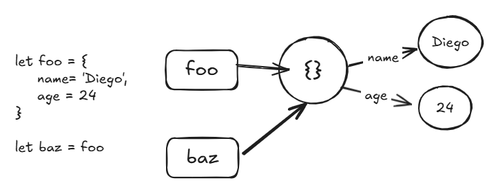
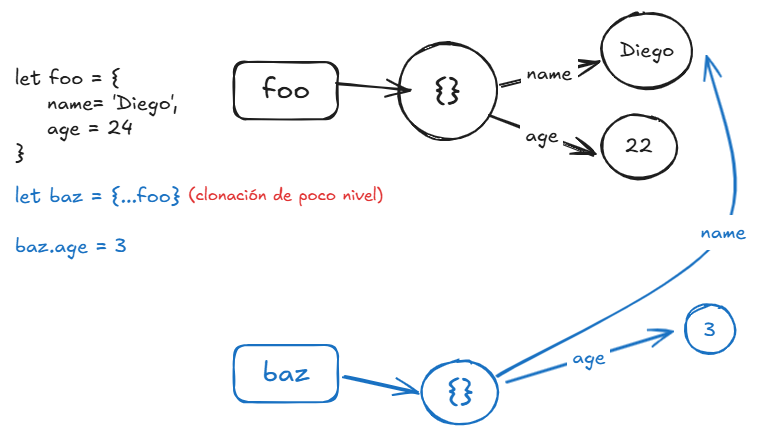

# APUNTES UD2 JS en lado Cliente

## Martes 10/12/2024

Etiqueta HTML Menú
Aplica listas dentro de li, se usa para botones y otro tipo de formularios
JS sirve para añadir FUNCIONALIDADES a los elementos HTML
Necesitamos reconocer los elementos que aparecen en la página, porque para JS no existe HTML como tal
Cuando llega el HTML ocurre:

- Parseado (Parse) -> DOM
- Renderización (Creación de un Layout)
- Lo pinta (Lo enseña en pantalla)
  \*\*IMG

Ahora, el parseo en JS es distinto, consiste en 3 elementos: Etiquetas (representadas con cajas), contenido (representadas con círculos) y flechas que las relacionan.
**IMG
IMPORTANTE: En JS los contenidos son ÚNICOS, si no vemos alguno no significa que no existan, solo que no se han inicializado.
** IMG ejemplo 3.
Se pueden ver más ejemplos del parser aquí:

### Document Object Model (DOM)

El document es una HTMLCollection, que tiene definidos sus nodos como CHILDNODES
Es una estructura jerárquica que modela el documento utilizando objetos, enlazando con nodos y todo se encuentra en la etiqueta CHILDREN.
Se usa la siguiente sentencia, para poder visualizarlo:

`console.dir(document.children[n].children[n]...children[n]);`

## Miércoles 11/12/2024

### Más información acerca del Parse en JS

En JS, los objetos no pueden mutar, pero si cambiar la información de sus propiedades.


Por ello cuando a _baz_ le cambiamos el valor a alguno de sus campos, ocurre esto:


Ahora, esto es peligroso ya que podemos perder información dentro del código sin quererlo, para ello podemos **CLONAR** el objeto, así:


> [!NOTE]
> El DOM es un **Objeto** que apunta a **Propiedades** que tienen otros objetos, así hasta terminar de recorrer el documento.

### Más información acerca de los selectores e ID

- **IDENTIFICADOR DATA-ID como ATRIBUTO en HTML:**
  Se genera así: `<tag html data-id="value">`

  Esto se selecciona en CSS utilizando
  `[data-id="value"] {property: value}`

  Y en Java utilizando:
  `document.querySelector("[data-id] = 1")`

- **Uso de selectores en JS**

  Actualmente se utiliza el comando `document.querySelector()` que nos sirve a la hora de **\*UBICAR**\_ objetos utilizando los **selectores** que crees en tu proyecto.

  Si `querySelector()` no encuentra lo que le mandas, te responderá con un **NULL** o con un **UNDEFINED**, sabiendo esto puedes realizar operaciones lógicas

  También existe el método `querySelectorAll()` que se utiliza a la hora de ubicar clases, elementos HTML varios y atributos, de la siguiente manera:

  ```Javascript
    // Elementos varios
    document.querySelectorAll("p");
    // Clases
    document.querySelectorAll(".basic");
    // Atributos
    document.querySelectorAll('[name = "name value"]');
  ```

  Si `querySelectorAll()` no encuentra lo que le mandas, te responderá con un **NULL** o con un **[void]** si es que le mandas a buscar clases o atributos, sabiendo esto puedes realizar operaciones lógicas.

- **NORMAS DE USO DE LOS ID EN HTML**

  - El oficial es **data-id**
  - El id es _ÚNICO_, por ende este ejemplo:

    ```HTML
      <header id="header-1" class="main-header">
        
        <h1 data-id="1">Saludos</h1>
      </header>
      <main id="header-1" data-id="2"></main>
    ```

    Es \*\*ERRÓNEO\*\*\*, ya que tiene al id **header-1** en 2 posiciones.

  - También, por convenio, los **id** tienen que empezar **siempre** con una letra.

### Pareja Clave - Valor en HTML (dl)

Es una estructura similar a las listas donde puedes asignar una cabecera `<dt>` y los elementos que pertenecen ahí `<dd>`.

Para que [la estructura _dl_ en index.html](../web/index.html) pueda recibir datos, utilizaremos una codificación en JS. Para ello vamos a crear el siguiente **array de objetos**:

```JavaScript
const players = [
  { firstName: "", surname: "", alias: "", icon: "" },
  { firstName: "", surname: "", alias: "", icon: "" },
];
```

> [!IMPORTANT]
> Para añadir un valor dentro de una propiedad del objeto utilizo la siguiente sentencia:
>
> `players[1].alias = players[1].firstName;`.
>
> En ese caso, el _alias_ del objeto[1] coge el valor del _firstName_ del objeto[1].

Luego de declarar **_players_** vamos a realizar la sentencia para poder seleccionar las etiquetas HTML que vamos a modificar desde nuestro [index.js](../web/index.js "Index JS"):

`const ddElements = document.querySelectorAll(".tres-raya dd");`

Entendemos que hay varios _ddElements_ dentro del código HTML

-- Para evitar errores, en el **script** de HTML, debes de declararlo como type="module"

## Lunes 16/12/2024

- Hoisting: Este término fue pensado como una manera general de referirse a como funcionan los contextos de ejecución.

¿Cómo se accede a un elemento que ya ha sufrido un action Event? Un AddEventListener siempre recibe un event.target (un trigger en otras palabras) que tenemos que inicializar como una constante tipo button

`const elementButton = event.target`

Y yo, a ese elemento le puedo otorgar una clase según corresponda, utilizando el atributo `.classList.add('nombre de la clase')`.

- FORM DATA: Nos ayuda a la hora de realizar subidas de ficheros y o información.

VALIDACIÓN:

2 funciones para customizar:
setCustomValidity(): Añade una cadena de caracteres con los errores que desees.
reportValidity(): Nos ayuda a detectar errores en la interfaz.

## Jueves 19/12/2024

### Asincronía

Es importante saber que las evaluaciones que se realizan a la hora de ejecutar páginas web, solicitud de consultas, etc, hay tiempos muertos mientras se realizan esas ejecuciones.

JS es un lenguaje monohilo, es por ello que es muy potente a la hora de ejecutar muchas operaciones a la vez, que no consuman recursos del procesador, pero no es bueno a la hora de realizar cálculo.

Un sistema paralelo consiste en tener un hilo para cada instrucción, es decir, si hay 100 instrucciones llegando, sí o sí debe de tener 100 hilos para ser eficiente, es por ello que este sistema no brilla.

JS para solucionar ello utiliza los sistemas asíncronos, que es aprovechar los espacios libres para poder ejecutar otras funciones en cola. Existe las funciones como `setTimeOut` que se encarga de paralizar el tiempo de ejecución por cierto rango de tiempo y nos sirve para visualizar este fenómeno, ya que genera asincronía.

Las promesas son similares a setTimeOut, pero tienen mayor prioridad, así que se ejecutan antes.
Son objetos algo raros, salvo que el usuario lo podrá ver en un futuro. Se crean utilizando un new y la palabra reservada Promise.

Callbacks en asincronía: Se usan para llamar a la función requerida y poder ejecutarla

async: Convierte cualquier función en asíncrona, devolviendo siempre una promesa. Es útil a la hora de utilizarlas en entornos específicos. Por ejemplo, no existen servicios sincronos, ya que bien sabemos que la red toma tiempo para ejecutarse, por ende tiene tiempo muerto en el cuál no ha hecho nada. Para ello tenemos que volverla asíncrona para así evitar esos tiempos muertos.

Async - await: Permite utilizar código asíncrono.

## Martes 07/01/2025

### GoT work

Para importar un JSON en un archivo JS, se tiene que utilizar la siguiente ruta:

`import DATA from 'ubicacionfichero.json' with {type: 'json}`

En `index.js` voy a recibir ese JSON

Para recorrer el archivo JSON (ya que, al ser una fuente de datos, se tiene que tomar como un array), tenemos que utilizar la siguiente sentencia:

```JS
DATA.forEach((character) => {
  createCharacter('ul', 'afterbegin', character);
})
```

### Render Models

Hay que entender DONDE se están produciendo las cosas y los distintos modos PARA poderlas realizar

1. Creación manual en el servidor
2. SSG (Static Site Generation): El sitio se genera en el servidor en TIEMPO de compilación (ahead of time), esto es poco flexible a la hora de querer crear una web dinámica. Es muy rápido a la hora de devolver un valor, ya que todo esta construido.
3. SSR (Server Side Rendering): Subo al servidor un programa JS, y cuando el usuario realiza la petición EN EL SERVIDOR, se genera un HTML (render) que cumpla los requerimientos de esa petición(just in time).
4. CSR (Client Side Rendering): Se genera el HTML en el cliente en tiempo de ejecución (just in time). La desventaja es que el cliente trabaja más y descargar muchos archivos JS, también es que si soy un _indexador_ (Google por ejemplo) no reconoce los cambios realizados en su código fuente, aunque los enseñe

No hay modelo bueno, cada uno tiene sus ventajas y desventajas, todo depende del proyecto que deseas realizar. Por ejemplo, en una aplicación de banco es buena idea utilizar CSR, pero no para una landing page.

#### Framework Astro

Aparece como una **solución** para webs con _mucho contenido_ pero _poco dinamismo_, esto es para poder optimizar el tiempo de respuesta en el servidor. Un blog, landing pages son ejemplos perfecto para poder utilizar astro. Una página operativa no lo es.

Para poder iniciar un proyecto nuevo, solo tenemos que ir a la web de [astro](https://astro.build/ "Astro")

Los framework son una serie de estructura de trabajo, para poder estructurar tu proyecto según las normas del framework seleccionado.

La estructura de los proyectos es el **_scaffolding_**

Public, ahi se coloca lo que queremos que se suba de manera directa, es transparente.

Scripts:

dev: El index se construye en tiempo de compilación, para ello se tiene que ejecutar en consola `npmp run dev` para poder enseñar la web en modo de desarrollo.

build: Crea la build de la aplicación, y esto lo guarda en una carpeta oculta llamada dist, donde se guardará la web que querremos subir a producción.

preview: Nos enseña la web que creamos con el build

Todo archivo que coloques en la carpeta "pages" se enrutara automáticamente.

Astro favorece el uso de COMPONENTES, por ello es tan popular y cómodo de utilizar.

Todo lo que se coloca en el _template_ de Astro, soporta HTML y CSS

```js
---
// Front matter: Son los metadatos que se pueden agregar a un archivo Markdown o MDX. En este caso, se está utilizando para definir el título de la página.
// Aquí va el JS/TS
const title = 'Hello GoT'
console.log(title);
---

<h1>{title}</h1>

<style>
    h1 {
        color: #187559e0;
    }
</style>
```

Cuando creas un componente siempre será una _función_ que construye **objetos** que están pensadas en ser utilizadas **declarativamente**

Se importan de la siguiente manera:

```js
import Footer from "../components/footer.astro";
```

Y se utiliza en el template de la siguiente forma:

```js
<Footer />
```

Si queremos crear un componente que reciba cosas, podemos generar un Front Matter con las constantes que queramos utilizar

```js
const props = Astro.props

<footer>
  Soy el footer de {props.owner}
</footer>
```

Y en la _page_ vamos a colocar ese _owner_

```js
<Footer owner="Pepe" />
```

Ahora, es recomendable **desestructurar** estas **_Props_**, y nuestro código del componente _footer_ cambiará de la siguiente manera:

```js
---
// Props
// Definir el tipado (TS)
type Props = {
    owner: string
}
const {owner} = Astro.props
---

<footer>
    Soy el footer de {owner}
</footer>
```

##### Layouts

Son la carpeta donde generaremos los metadatos de las _pages_ que vamos a utilizar.

A la hora de referenciar un favicon, si ese esta en public, solo debemos colocar el nombre del archivo.

Ahora, esto en concepto es como un envolvente, que utilizará un **slot** para colocar la información de la _page_ que se ha creado.

Esta interacción se realiza de la siguiente manera:

- Layout (layoutGoT.astro)

  ```js

  ```
